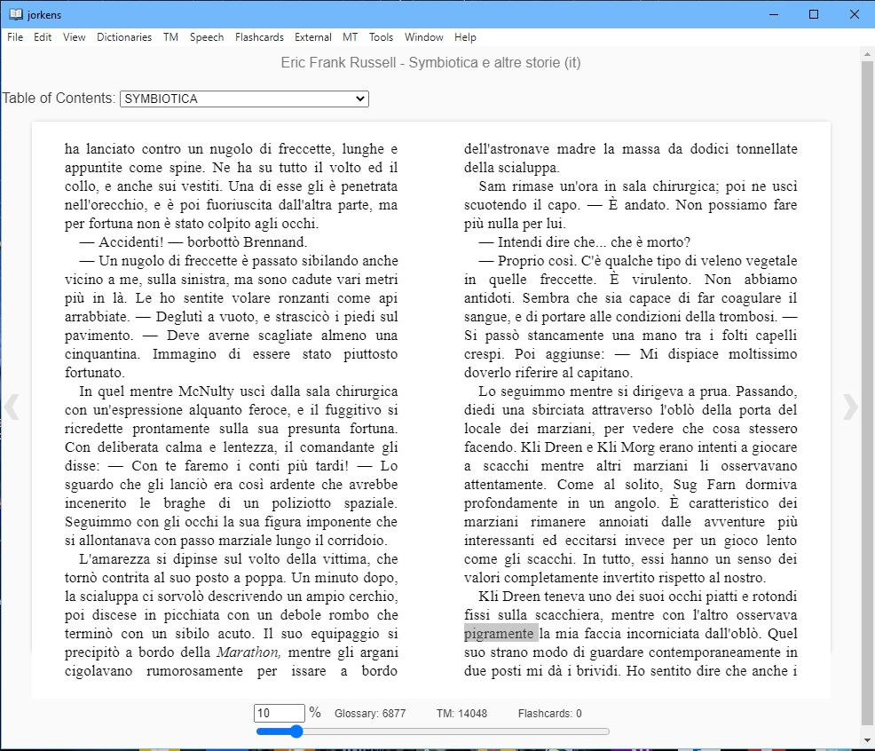
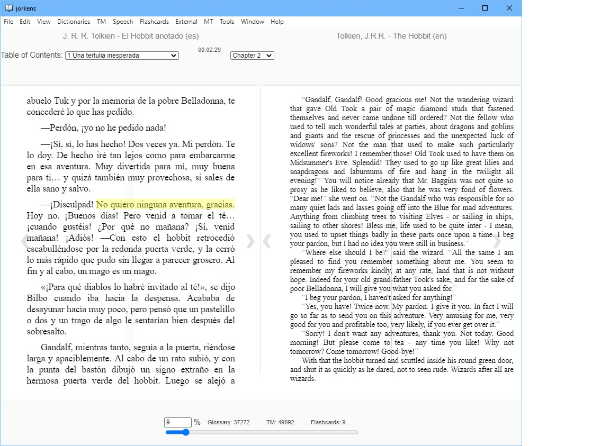

# jorkens
Jorkens is a desktop epub reader (an Electron application) based on epub.js and intended for foreign language learners. If Calibre is installed (recommended), Jorkens can also use Calibre's conversion tool to convert other ebook formats to epub transparently before opening them. Users can also add their own Python scripts to add functionality to Jorkens. 

Jorkens can search for definitions of foreign words in numerous online dictionaries, and also uses a SQLite database for a local glossary and translation memory. (Note: The  database is initially empty, and needs to be populated before search results can be returned.) A highlighted word or partial word will be automatically looked up in the glossary, and any matches will be displayed; if none are found, a concordance search will be done next (see next paragraph). Glossaries can be imported from and exported to text files. See the Wiki for some useful sources of dictionary/glossary data. 

The local translation memory can be used for bilingual concordance searches, showing all sentences where the highlighted word was found as well as their translations.  It can thus function indirectly as a secondary dictionary. The results returned are currently limited to 100 hits. Jorkens can also perform similar concordance searches on the Linguee Web site.  Translation memories can be imported from .tmx (Translation Memory eXchange) files. 

Jorkens can also search Google Images for highlighted words; image search results can be surprisingly useful for showing the meanings of foreign words, as well as finding images to use in flashcards. 

Jorkens currently supports text-to-speech (TTS) using a number of Windows TTS voices (as long as the user has installed the ones needed), as well as Amazon Polly for more limited passages (note that Amazon Polly voices can also be downloaded and installed locally). Jorkens can also search Forvo for individual word pronunciations. 

So far Jorkens supports machine translation through Amazon Translate; some support for Google Translate has been added. 

Jorkens has an internal flashcard database and basic flashcard review, with cards presented in random order so you can test whether you know a card or not, with a score kept for the current review session. This is not a spaced repetition system (SRS), though that may come later. Jorkens' flashcards can be exported to text files to be imported into Anki, a very good SRS program, however. Anki can also be opened from the Jorkens menu.

The Tools menu includes an option to generate a word frequency list, and save it as a .csv file. Jorkens applies stopwords and lemmatizes the words before producing the word frequency list. 

Users can run Python scripts, using for example natural language processing toolkits like NLTK or Spacy, against the book's or chapter's text for further analysis. Scripts found in Documents\Jorkens\Python should appear under the External/Python scripts menu. Some sample Python scripts can be found on the Wiki. 

For future goals and desired features, see the Wiki. 

Jorkens has so far been tested mostly on a Windows 10 machine, but it should be possible to build Linux and MacOS versions in the future with minor modifications. Jorkens seems to run fairly well from the source code under Linux. Compiled released versions will be posted occasionally, but in between, users should be able to run the working source code after installing node.js, npm, and Electron, by executing 'npm start' at the command line in the main jorkens directory. 

The name Jorkens is from the storyteller character in the short story collections by Lord Dunsany. 

## Lemmatization ##

Lemmatization, converting inflected forms of words to their dictionary forms (lemmas), greatly improves dictionary lookup functions. Jorkens is currently able to use TreeTagger at https://www.cis.uni-muenchen.de/~schmid/tools/TreeTagger/ for lemmatization, e.g. highlighting the Italian word "tuffamo" will show results for the infinitive form "tuffare." Users who wish to take advantage of this should install the Windows version per the instructions at that link, as well as the parameter files for the foreign languages they need to use. The graphical interface mentioned there is not necessary. The languages supported by TreeTagger include German, English, French, Italian, Danish, Swedish, Norwegian, Dutch, Spanish, Bulgarian, Russian, Portuguese, Galician, Greek, Chinese, Swahili, Slovak, Slovenian, Latin, Estonian, Polish, Romanian, and Czech. 

For Linux, Jorkens will expect the TreeTagger executable to be at ~/TreeTagger/bin/tree-tagger.

Jorkens can now also use Stanford NLP's Python library Stanza for lemmatization as well, and TreeTagger support may be dropped in the future. Stanza supports 66 languages; see https://stanfordnlp.github.io/stanza/available_models.html for details. Users will need to have Python 38 and Stanza installed (pip install stanza), in addition to downloading the models for the languages they need (e.g. "import stanza" and then "stanza.download('es')." 
